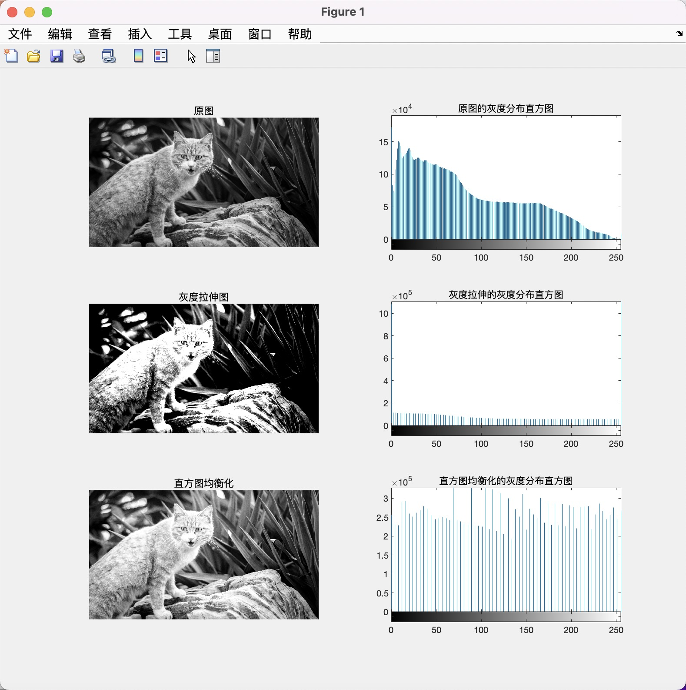

# 多媒体Project2实验文档

[TOC]

## test_1 获取图片的RGB值

## test_2 实现rgb2gray

### 对比图

## test_3灰度图对比度增强

### 对比图与灰度值分布图

### 对灰度拉伸和直方图均衡化的理解

灰度拉伸只是线性的拉宽对比度，是一种简单的线性点运算，它扩展图像的直方图，使其充满整个灰度级范围内，并不会破坏原有像素的排序，对图像的整体影响不大。而直方图均衡化却对图像的整体效果有影响，对直方图的改变也比较大；

直方图均衡化的作用是图像增强。这种方法对于背景和前景都太亮或者太暗的图像非常有用。其基本思想是把原始图像的直方图变换为均匀分布的形式，重新分配图像像素值，使得灰度值可以更均匀的分布在更多的灰度级上，这样增加了灰度值的动态范围，从而达到增强图像整体对比度的效果。

 

## test_4 图像去噪

### 对比图

### 造成差异的原因

中值滤波是将某个像素领域中的像素按灰度值进行排序，然后选择该序列的中间值作为输出的像素值，让周围像素灰度值的差比较大的像素改取与周围的像素值接近的值，从而可以消除孤立的噪声点。因此中值滤波相对而言只关心这些点像素值的相对大小，而对于极限像素值并不敏感，所以效果较好。

均值滤波把每个像素都用周围的像素坐均值操作，速度快，算法简单，但是滤波时收到噪声点的影响，会无法去掉噪声，只能微弱地减弱噪声。故效果不如中值滤波好。
